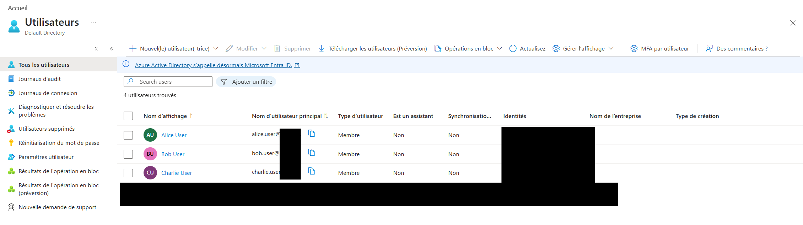
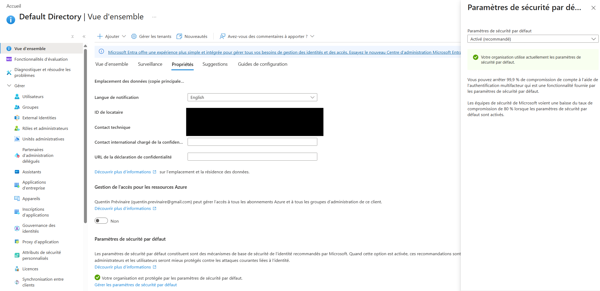
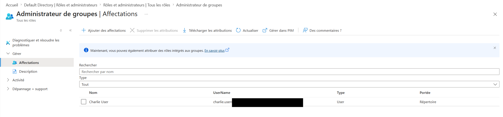
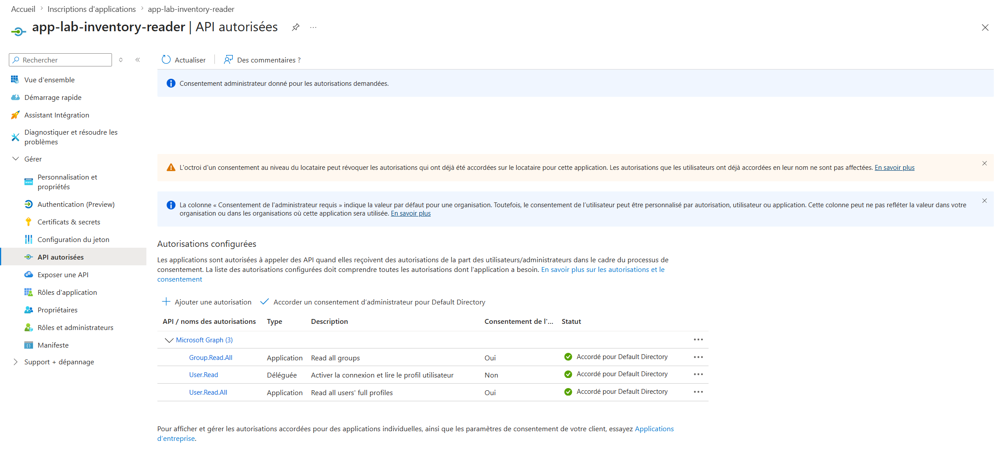
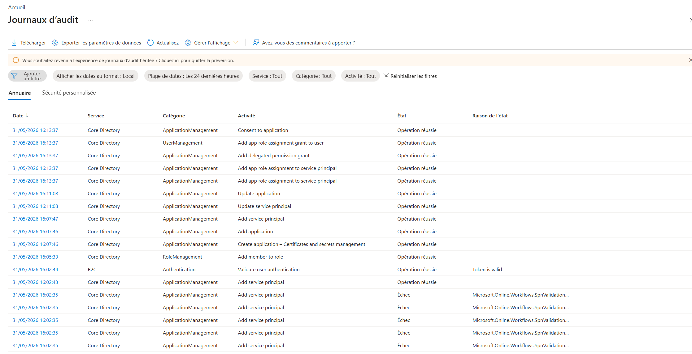

# Microsoft Entra ID Security Lab

This repository documents a Microsoft Entra ID security lab focused on cloud identity management, least privilege, MFA baseline protection, application permissions and audit visibility.

The goal is to simulate basic identity administration tasks commonly found in small and medium business environments using a dedicated lab tenant.

## Project Objectives

- Create cloud-only Entra ID users
- Create security groups for role-based organization
- Apply least privilege principles with limited admin role assignment
- Enable and document Security Defaults
- Register an internal application
- Configure Microsoft Graph read-only permissions
- Review sign-in and audit logs
- Document security considerations and lessons learned

## Lab Scope

This lab uses a dedicated Microsoft Entra ID tenant created for portfolio and learning purposes.

No production tenant, school tenant or employer tenant is used for the documented work.

## Implemented Components

### Cloud Users

- Alice User
- Bob User
- Charlie User

### Security Groups

- GG-Lab-Users
- GG-Lab-IT-Admins
- GG-Lab-MFA-Required

### Admin Role Assignment

Charlie User was assigned the limited built-in role:

- Groups Administrator

This demonstrates the principle of least privilege. No lab user was assigned Global Administrator.

### Security Defaults

Security Defaults are enabled in the tenant to provide a basic Microsoft-recommended security baseline.

### App Registration

An internal single-tenant application was registered:

- app-lab-inventory-reader

Microsoft Graph permissions were configured with read-only access:

- User.Read.All
- Group.Read.All

Admin consent was granted in the lab tenant.

### Logs

The following logs were reviewed:

- Sign-in logs
- Audit logs

These logs show successful administrative operations such as user/group management, app registration changes, role assignment and admin consent.

## Screenshots

Screenshots are stored in the `screenshots/` directory.

Sensitive information is masked before publication, including:

- personal email addresses
- tenant IDs
- subscription IDs
- application/client IDs
- object IDs
- public IP addresses
- request IDs
- correlation IDs
- generated `.onmicrosoft.com` domains containing personal identifiers

## Documentation

- [Architecture](docs/architecture.md)
- [Users and Groups](docs/users-and-groups.md)
- [Roles and Least Privilege](docs/roles-and-least-privilege.md)
- [Security Defaults](docs/security-defaults.md)
- [App Registration](docs/app-registration.md)
- [Audit and Sign-in Logs](docs/audit-and-signin-logs.md)
- [Security Notes](docs/security-notes.md)
- [Lessons Learned](docs/lessons-learned.md)

## Technologies

- Microsoft Entra ID
- Azure Portal
- Microsoft Graph permissions
- Identity and Access Management
- MFA / Security Defaults
- Audit logs
- Sign-in logs

## Project Status

Status: Phase 1 completed

Implemented:

- cloud users
- security groups
- group memberships
- Security Defaults
- limited admin role assignment
- app registration
- Microsoft Graph read-only permissions
- admin consent
- audit and sign-in log review

Planned future improvements:

- Conditional Access policies if licensing allows
- Privileged Identity Management if licensing allows
- hybrid identity with on-premises Active Directory
- automated user/group inventory using Microsoft Graph

## Project Screenshots

### Cloud-only users

### Security Defaults enabled

### Limited admin role assignment

### Microsoft Graph read-only permissions

### Audit logs

