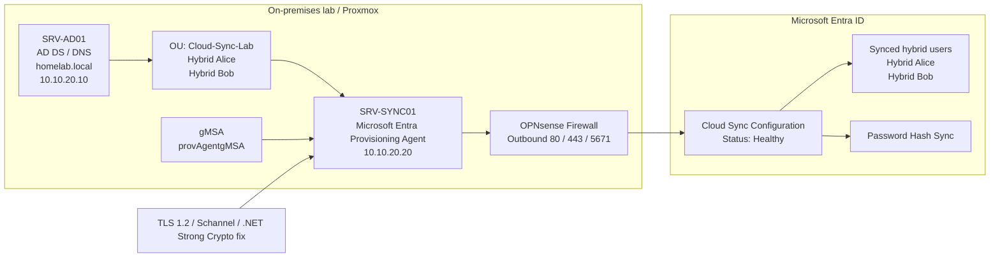

# Hybrid Cloud Sync Architecture Diagram

This diagram summarizes the hybrid identity flow between the on-premises Active Directory lab and Microsoft Entra ID.

## Key Points

- The synchronization scope is limited to the `Cloud-Sync-Lab` OU.
- The Microsoft Entra Provisioning Agent runs on `SRV-SYNC01`.
- The agent uses a gMSA named `provAgentgMSA`.
- Password hash synchronization is enabled.
- Outbound firewall access is restricted to required web and Entra sync ports.
- A TLS 1.2 / Schannel / .NET Strong Crypto fix was required to resolve the initial WebSocket issue.
