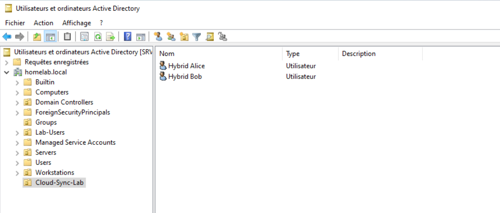
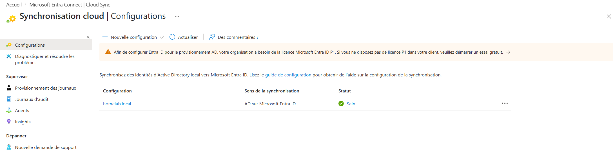
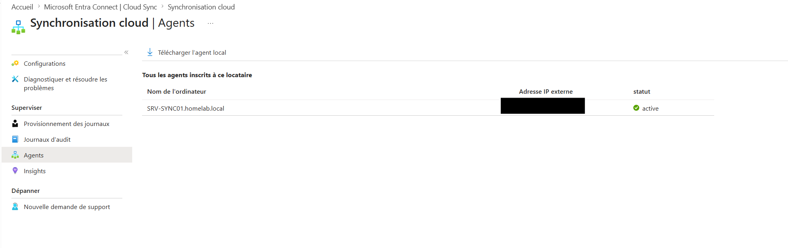
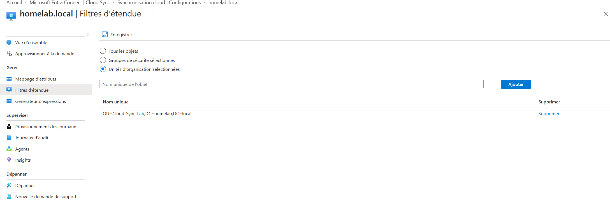
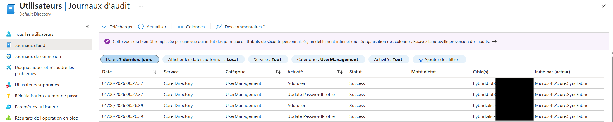
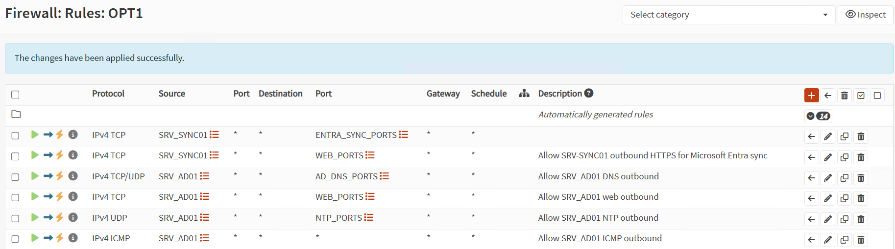

# Hybrid Identity with Microsoft Entra Cloud Sync

## Objective

This phase demonstrates a hybrid identity setup between an on-premises Active Directory domain and Microsoft Entra ID using Microsoft Entra Cloud Sync.

The goal was to synchronize a dedicated test OU from the local Active Directory environment to Microsoft Entra ID while keeping the configuration scoped, controlled, and safe for a lab environment.

## Architecture

Flow:

AD DS on SRV-AD01 -> SRV-SYNC01 with Microsoft Entra Provisioning Agent -> Microsoft Entra ID

Local infrastructure:

- SRV-AD01
  - Active Directory Domain Services
  - DNS
  - Domain: homelab.local
  - IP address: 10.10.20.10
  - Network: SERVERS / OPT1

- SRV-SYNC01
  - Windows Server 2022
  - Microsoft Entra Provisioning Agent
  - Joined to homelab.local
  - IP address: 10.10.20.20
  - DNS server: 10.10.20.10
  - Network: SERVERS / OPT1

- Microsoft Entra ID
  - Cloud Sync configuration
  - Password hash synchronization enabled
  - Synchronization scoped to a dedicated test OU

## Active Directory Preparation

A dedicated OU was created in the local Active Directory domain:

OU=Cloud-Sync-Lab,DC=homelab,DC=local

Two test users were created in this OU:

- Hybrid Alice
- Hybrid Bob

The distinguished name of Hybrid Alice was validated as:

CN=Hybrid Alice,OU=Cloud-Sync-Lab,DC=homelab,DC=local

The purpose of this OU was to avoid synchronizing the full Active Directory domain. Only lab test users were placed in scope.

## SRV-SYNC01 Validation

Before installing and configuring Cloud Sync, SRV-SYNC01 was validated.

The server was joined to the domain homelab.local.

The following checks were performed successfully:

- Domain controller discovery with nltest
- Secure channel validation with Test-ComputerSecureChannel
- DNS resolution through SRV-AD01
- AD connectivity to SRV-AD01
- RSAT AD PowerShell query against Hybrid Alice

Validated AD connectivity included:

- DNS: TCP/UDP 53
- Kerberos: TCP 88
- RPC: TCP 135
- LDAP: TCP 389
- SMB: TCP 445
- Global Catalog: TCP 3268

## Microsoft Entra Provisioning Agent

The Microsoft Entra Provisioning Agent was installed on SRV-SYNC01.

During setup, the agent was connected to the Microsoft Entra tenant using a dedicated cloud admin account.

A group managed service account was created by the setup wizard:

homelab.local\provAgentgMSA

The agent appeared in Microsoft Entra Cloud Sync as active:

SRV-SYNC01.homelab.local

The following Windows services were validated:

- AADConnectProvisioningAgent
- AzureADConnectAgentUpdater

## Cloud Sync Configuration

A Cloud Sync configuration was created for the domain:

homelab.local

Configuration details:

- Synchronization direction: Active Directory to Microsoft Entra ID
- Password hash synchronization: enabled
- Scope: selected organizational units only
- Selected OU: OU=Cloud-Sync-Lab,DC=homelab,DC=local

The configuration was intentionally not applied to the whole domain.

## On-Demand Provisioning Validation

Before relying on scheduled synchronization, on-demand provisioning was tested.

The following users were provisioned successfully:

- Hybrid Alice
- Hybrid Bob

The provisioning logs showed successful Create actions from Active Directory to Microsoft Entra ID.

This confirmed that:

- The local AD objects were readable by the agent
- The scoping filter was correct
- The agent could communicate with Microsoft Entra ID
- The users could be created in Microsoft Entra ID

## Issue Encountered: Cloud Sync Timeout

During the first provisioning attempts, on-demand provisioning failed with timeout errors.

The Microsoft Entra portal reported that the provisioning service could not receive a response from the target system within the expected time.

The agent was visible as active in Microsoft Entra, but the provisioning operation still failed.

This showed that an agent can be registered and visible while its real-time communication channel is still failing.

## Local Agent Logs

The local logs were located in:

C:\ProgramData\Microsoft\Azure AD Connect Provisioning Agent\Trace

The repeated error pattern was:

- Web socket failed to connect
- Error while establishing web socket connection
- An existing connection was forcibly closed by the remote host
- ConnectorSignalingWebSocket
- System.NullReferenceException

Secondary errors about metrics collector and performance counters were also present, but they were not the root cause.

## Troubleshooting Performed

The following areas were checked:

- AD connectivity from SRV-SYNC01 to SRV-AD01
- DNS resolution
- Microsoft endpoint HTTPS reachability
- OPNsense firewall rules
- WinHTTP proxy settings
- OPNsense Intrusion Detection
- Squid / SSL inspection
- Zenarmor / Sensei
- Cloud Sync scope
- Distinguished names of AD users
- Agent services
- Cloud Sync agent status in Microsoft Entra

Results:

- AD connectivity was working
- DNS resolution was working
- HTTPS access to Microsoft endpoints was working
- WinHTTP proxy was not configured
- OPNsense IDS was disabled
- Squid and Zenarmor were not installed
- The Cloud Sync agent was active
- Services were running
- The WebSocket channel still failed

## TLS / Schannel Root Cause

The issue was resolved by forcing TLS 1.2 for the Windows and .NET Framework stack used by the Microsoft Entra Provisioning Agent.

Windows Server 2022 can negotiate modern TLS versions, including TLS 1.3. In this lab, the Cloud Sync agent WebSocket channel failed until TLS 1.2 was explicitly enabled and .NET Framework strong cryptography was configured.

The applied fix included:

- Disabling TLS 1.3 client-side through Schannel
- Explicitly enabling TLS 1.2 client-side through Schannel
- Enabling SchUseStrongCrypto for .NET Framework 4.x
- Rebooting SRV-SYNC01
- Restarting the provisioning agent services

After this change, the WebSocket communication succeeded and on-demand provisioning worked.

## Cloud Sync Quarantine

After the successful fix, the Cloud Sync configuration briefly showed a quarantine status.

The error was:

HybridIdentityServiceNoActiveAgents

This likely happened because SRV-SYNC01 or the agent services were not running when Microsoft Entra attempted scheduled synchronization.

After SRV-SYNC01 and the services were running again, the Cloud Sync configuration returned to a healthy state.

Final Cloud Sync status:

Sain / Healthy

## Firewall Hardening

During troubleshooting, a temporary broad firewall rule was used for SRV-SYNC01.

After validation, the rule was removed or disabled.

Final OPNsense rules were hardened so that SRV-SYNC01 only had targeted outbound access.

Final SRV-SYNC01 outbound rules included:

- SRV_SYNC01 to WEB_PORTS
- SRV_SYNC01 to ENTRA_SYNC_PORTS

Alias examples:

- WEB_PORTS: TCP 80, 443
- ENTRA_SYNC_PORTS: TCP 443, 5671

The broad OPT1 net to any any troubleshooting rule was not kept as a permanent rule.

## Final Validated State

Final state of the lab:

- SRV-SYNC01 joined to homelab.local
- Microsoft Entra Provisioning Agent installed
- Agent visible as active in Microsoft Entra
- Cloud Sync configuration healthy
- Scope limited to Cloud-Sync-Lab OU
- Hybrid Alice synchronized successfully
- Hybrid Bob synchronized successfully
- Password hash synchronization enabled
- TLS 1.2 / Schannel / .NET Strong Crypto fix applied
- OPNsense firewall rules hardened
- Proxmox snapshot created after successful validation

Snapshot name:

srv-sync01-cloudsync-healthy

## Screenshots

Recommended screenshots for this phase:

- ad-cloud-sync-lab-ou-users.png
- entra-cloud-sync-configuration-healthy.png
- entra-cloud-sync-agent-active.png
- entra-cloud-sync-scope-ou.png
- entra-cloud-sync-audit-success.png
- opnsense-srv-sync01-firewall-rules.png
- srv-sync01-services-running.png

## Security Notes

Sensitive information must be masked before publishing screenshots:

- personal email addresses
- tenant ID
- subscription ID
- source IDs
- target IDs
- object IDs
- external IP address
- onmicrosoft.com tenant domain if identifiable
- request IDs
- correlation IDs
- transaction IDs

## Lessons Learned

This phase showed that a hybrid identity deployment is not only about installing an agent.

Important validation points included:

- limiting synchronization scope
- validating AD connectivity
- checking DNS and HTTPS connectivity
- reading local agent logs
- distinguishing agent registration from real provisioning health
- troubleshooting WebSocket communication issues
- hardening temporary firewall rules after troubleshooting
- documenting root cause and remediation

This troubleshooting process is valuable because it reflects real-world hybrid identity diagnostics.

## Screenshot Evidence

### Active Directory test OU

### Cloud Sync configuration healthy

### Cloud Sync agent active

### Cloud Sync scoped OU filter

### Successful user provisioning audit logs

### Hardened OPNsense firewall rules

